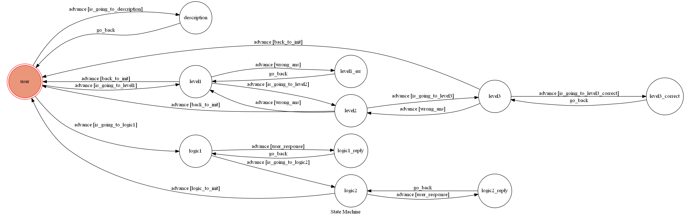

# TOC Project 2017
A telegram bot based on a finite state machine

英文單字測驗及邏輯測驗

## Setup

### Prerequisite
* Python 3

#### Install Dependency
```sh
pip install -r requirements.txt
```

* pygraphviz (For visualizing Finite State Machine)
    * [Setup pygraphviz on Ubuntu](http://www.jianshu.com/p/a3da7ecc5303)

### Secret Data

`API_TOKEN` and `WEBHOOK_URL` in app.py **MUST** be set to proper values.

### Run Locally
You can either setup https server or using `ngrok` as a proxy.

**`ngrok` would be used in the following instruction**

```sh
ngrok http 5000
```

After that, `ngrok` would generate a https URL.

You should set `WEBHOOK_URL` (in app.py) to `your-https-URL/hook`.

#### Run the sever

```sh
python app.py
```

## Finite State Machine


## Usage and Command
<<<<<<< HEAD
* state 說明

	* 起始 state 為 `user`.
	* 輸入"eng" 
		+ 進入 `level1` state，答對時進入`level1` state，再答對則進入`level3` state
		+ 過程中若答錯則倒退1個state，例如`level2`回到`level1`
		+ 在`level1`答錯或`level3`答對時會回到原本的state 
		+ 10題結束後，回到`user` state
	  
	* 輸入"logic" 
		+ 進入 `logic1` state，三題結束後進入`logic2` state
		+ 6題結束後，回到`user` state
	  
	* 輸入"help"
		+ 進入`description` state 並回到 `user` state


* 功能1:英文單字測驗(高中7000字)

	* 輸入 "eng" 開始遊戲
	* 答對可到下一個難度，答錯則到倒退一個難度 
	* 共有10題，答錯會顯示正確答案
	* 結束時，會顯示答對題數
	

* 功能2:簡單智商測驗

	* 輸入 "logic" 開始遊戲
	* 題目均以圖片顯示
	* 共有6題，答錯會顯示正確答案
	* 結束時，會顯示答對題數
	* 前三題為數字題，後三題為圖形題


* 功能3:

	* 輸入: "help" 可查看bot的說明
=======
* state 隤芣�

	* 韏瑕� state �� `user`.
	* 頛詨"eng" 
		+ �脣 `level1` state嚗�撠��脣`level1` state嚗�蝑��€脣`level3` state
		+ ��銝剛蝑�€€€1�tate嚗�憒level2`�`level1`
		+ �灼level1`蝑�level3`蝑������tate 
		+ 10憿���嚗��躬user` state
	  
	* 頛詨"logic" 
		+ �脣 `logic1` state嚗�憿����脣`logic2` state
		+ 6憿���嚗��躬user` state
	  
	* 頛詨"help"
		+ �脣`description` state 銝血��� `user` state


* �1:�望��桀�皜祇�(擃葉7000摮�)

	* 頛詨 "eng" ���
	* 蝑��臬銝��摨佗�蝑��€€銝€�摨� 
	* �望�10憿�蝑�＊蝷箸迤蝣箇�獢�
	* 蝯����＊蝷箇�撠���
	 
 � � �
* �2:蝪∪�箏�皜祇�

	* 頛詨 "logic" ���
	* 憿�誑��憿舐內
	* �望�6憿�蝑�＊蝷箸迤蝣箇�獢�
	* 蝯����＊蝷箇�撠���
	* ��憿�詨�憿�敺�憿�耦憿�


* �3:

	* 頛詨: "help" �舀�ot�牧��
>>>>>>> 5e86206f31b23bdc8c262be3a37ed36e60d34680
	


## Author
[石家瑋](https://github.com/F74032099)
